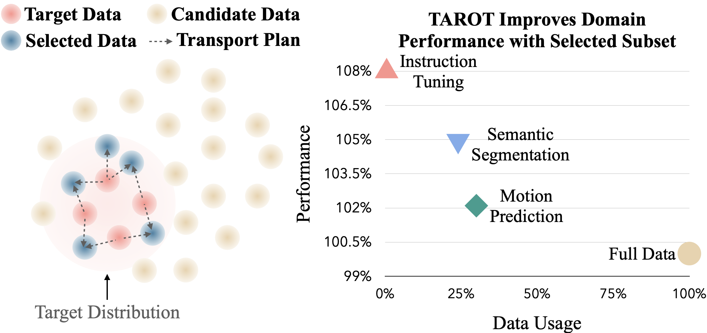
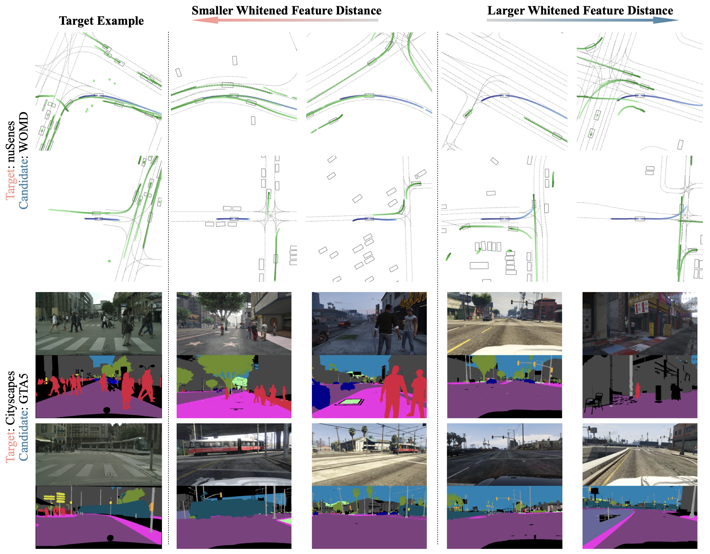

<div align="center">


# TAROT: Targeted Data Selection via Optimal Transport Distance Minimization
[Lan Feng](https://alan-lanfeng.github.io/), [Fan Nie](https://scholar.google.com/citations?user=o2lsU8YAAAAJ&hl=en), [Yuejiang Liu](https://sites.google.com/view/yuejiangliu/home), [Alexandre Alahi](https://people.epfl.ch/alexandre.alahi?lang=en)

[Visual Intelligence for Transportation Lab, EPFL](https://www.epfl.ch/labs/vita/) 

Stanford University
</div>



---

## 🛠 Environment Setup

To get started with TAROT, follow these steps:

1. **Set up UniTraj Environment**  
   Install necessary dependencies of [UniTraj repository](https://github.com/vita-epfl/UniTraj).

2. **Install Required Packages**  
   - Install [GeomLoss](https://www.kernel-operations.io/geomloss/).  
   - Install [Trak](https://trak.readthedocs.io/en/latest/).

[//]: # (3. **Clone TAROT**  )

[//]: # (   Clone this repository to your local machine.)

[//]: # ()
[//]: # (4. **Download Pretrained AutoBot Checkpoint**  )

[//]: # (   Download the pretrained [AutoBot checkpoint]&#40;https://drive.google.com/file/d/1Xus0EMm1wTfDt5c6_L6cLl4wcIlK6MEL/view?usp=sharing&#41;. Place the checkpoint in `unitraj/unitraj_ckpt`.)

---

## 🚀 Quick Start

1. **Run Data Selection**  
   Execute the following command to perform data selection. Refer to `configs/data_selection.yaml` for configuration options.
   ```bash
   python data_selection.py

2. **Train a New Model**  
   Train a new model using the selected data. Refer to `train.py` for training options.
   ```bash
   python train.py
   
Note: This process is a quick demo on a several samples in the nuScenes dataset. You can refer to [UniTraj repository](https://github.com/vita-epfl/UniTraj) for larger scale experiments.

## 🧪Additional Experiments
TAROT supports additional experiments for targeted data selection.
### Semantic Segmentation
We use the [awesome-semantic-segmentation-pytorch](awesome-semantic-segmentation-pytorch) repository for targeted data selection experiments in semantic segmentation.
Follow the example in data_selection.py to implement your experiment.
### Instruction Tuning
For instruction tuning, we use the [LESS](https://github.com/princeton-nlp/LESS) framework.
Adapt data_selection.py as needed to run instruction tuning experiments.


## 📊Qualitative Results
